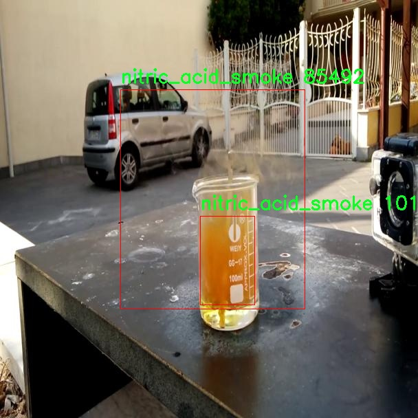

# 化学反应烟雾检测系统源码分享
 # [一条龙教学YOLOV8标注好的数据集一键训练_70+全套改进创新点发刊_Web前端展示]

### 1.研究背景与意义

项目参考[AAAI Association for the Advancement of Artificial Intelligence](https://gitee.com/qunmasj/projects)

项目来源[AACV Association for the Advancement of Computer Vision](https://kdocs.cn/l/cszuIiCKVNis)

研究背景与意义

随着工业化进程的加快，化学反应过程中产生的烟雾对环境和人类健康的影响日益显著。烟雾不仅是空气污染的重要成分，还可能含有多种有害物质，导致呼吸系统疾病和其他健康问题。因此，及时、准确地检测和识别化学反应烟雾，成为环境监测和公共安全领域的重要任务。传统的烟雾检测方法多依赖于人工观察和简单的传感器，这些方法不仅效率低下，而且容易受到人为因素的影响，难以保证检测的准确性和实时性。因此，基于计算机视觉和深度学习技术的自动化烟雾检测系统应运而生，成为研究的热点。

YOLO（You Only Look Once）系列模型因其高效的实时目标检测能力而广泛应用于各类视觉任务。YOLOv8作为该系列的最新版本，结合了更为先进的特征提取和目标识别技术，能够在复杂环境中实现高精度的目标检测。通过对YOLOv8模型的改进，可以进一步提升其在烟雾检测中的表现，尤其是在处理不同种类和浓度的烟雾时。针对化学反应过程中产生的烟雾特征，改进后的YOLOv8模型将能够更好地适应多样化的场景和条件，从而实现更为精准的烟雾识别。

本研究将基于改进YOLOv8的化学反应烟雾检测系统，利用一个包含2897张图像和5个类别（包括烟雾）的数据集进行训练和测试。该数据集的丰富性和多样性为模型的训练提供了良好的基础，能够有效提高模型的泛化能力和识别精度。通过对不同类别烟雾的深入学习，改进后的YOLOv8模型将能够在各种环境下实现高效的烟雾检测，帮助及时发现潜在的安全隐患。

此外，基于深度学习的烟雾检测系统在工业生产、环境监测、消防安全等领域具有广泛的应用前景。通过实现自动化监测，可以显著提高烟雾检测的效率和准确性，降低人工成本，减少人为错误。同时，该系统还可以与其他监测设备和系统进行联动，实现更为全面的环境监测和管理。随着技术的不断进步，基于改进YOLOv8的烟雾检测系统将为相关领域提供更加智能化的解决方案，推动安全生产和环境保护的进程。

综上所述，本研究不仅具有重要的理论意义，也具有广泛的实际应用价值。通过对YOLOv8模型的改进和优化，结合丰富的数据集信息，构建高效的化学反应烟雾检测系统，将为烟雾监测技术的发展提供新的思路和方法，为保障人类健康和环境安全贡献力量。

### 2.图片演示


##### 注意：由于此博客编辑较早，上面“2.图片演示”和“3.视频演示”展示的系统图片或者视频可能为老版本，新版本在老版本的基础上升级如下：（实际效果以升级的新版本为准）

  （1）适配了YOLOV8的“目标检测”模型和“实例分割”模型，通过加载相应的权重（.pt）文件即可自适应加载模型。

  （2）支持“图片识别”、“视频识别”、“摄像头实时识别”三种识别模式。

  （3）支持“图片识别”、“视频识别”、“摄像头实时识别”三种识别结果保存导出，解决手动导出（容易卡顿出现爆内存）存在的问题，识别完自动保存结果并导出到tempDir中。

  （4）支持Web前端系统中的标题、背景图等自定义修改，后面提供修改教程。

  另外本项目提供训练的数据集和训练教程,暂不提供权重文件（best.pt）,需要您按照教程进行训练后实现图片演示和Web前端界面演示的效果。

### 3.视频演示

[3.1 视频演示](https://www.bilibili.com/video/BV1262uY8EbP/)

### 4.数据集信息展示

##### 4.1 本项目数据集详细数据（类别数＆类别名）

nc: 5
names: ['ammonia_flame', 'ammonia_smoke', 'bromine_flame', 'bromine_smoke', 'nitric_acid_smoke']


##### 4.2 本项目数据集信息介绍

数据集信息展示

在本研究中，我们采用了名为“create4f”的数据集，以训练和改进YOLOv8模型，旨在提升化学反应过程中烟雾的检测能力。该数据集专注于五种特定类别的烟雾和火焰，涵盖了化学反应中常见的危险物质。这些类别包括：氨气火焰（ammonia_flame）、氨气烟雾（ammonia_smoke）、溴火焰（bromine_flame）、溴烟雾（bromine_smoke）以及硝酸烟雾（nitric_acid_smoke）。通过对这些类别的深入分析和研究，我们希望能够实现更高效的烟雾检测，进而提高实验室和工业环境中的安全性。

“create4f”数据集的构建基于多种实验室环境下的实际化学反应场景，数据来源于多个实验室的实际操作记录，确保了数据的真实性和多样性。每个类别的数据样本均经过精心挑选，涵盖了不同浓度、不同光照条件以及不同背景下的烟雾和火焰图像。这种多样性不仅有助于模型的泛化能力，还能提高其在复杂环境中的检测准确性。

在数据集的标注过程中，采用了先进的图像标注技术，确保每个样本的火焰和烟雾区域都被准确地框定。这一过程不仅提升了数据集的质量，也为后续的模型训练提供了可靠的基础。通过对这些图像进行细致的标注，我们能够有效地训练YOLOv8模型，使其在面对真实场景时能够快速而准确地识别出不同类型的烟雾和火焰。

在数据集的构成上，五个类别的样本数量相对均衡，确保了模型在训练过程中不会偏向某一特定类别。这种均衡性对于提高模型的整体性能至关重要，因为在实际应用中，化学反应可能会同时产生多种类型的烟雾和火焰，模型需要具备识别和区分这些不同类型的能力。此外，数据集中还包含了多种背景和环境条件下的样本，使得模型能够适应不同的工作场景。

通过使用“create4f”数据集，我们的目标是提升YOLOv8在化学反应烟雾检测中的表现。该数据集不仅为模型提供了丰富的训练素材，也为研究人员提供了一个良好的平台，以探索和验证不同的检测算法和技术。随着化学反应过程中安全隐患的日益增加，能够及时、准确地检测出烟雾和火焰，将对保护实验室人员的安全、降低事故发生率具有重要意义。

综上所述，“create4f”数据集为化学反应烟雾检测系统的研究提供了坚实的基础，借助这一数据集，我们期望在YOLOv8模型的训练和应用中取得显著的进展，从而为化学反应的安全监测和管理提供更为有效的技术支持。





### 5.全套项目环境部署视频教程（零基础手把手教学）

[5.1 环境部署教程链接（零基础手把手教学）](https://www.ixigua.com/7404473917358506534?logTag=c807d0cbc21c0ef59de5)


[5.2 安装Python虚拟环境创建和依赖库安装视频教程链接（零基础手把手教学）](https://www.ixigua.com/7404474678003106304?logTag=1f1041108cd1f708b01a)

### 6.手把手YOLOV8训练视频教程（零基础小白有手就能学会）

[6.1 手把手YOLOV8训练视频教程（零基础小白有手就能学会）](https://www.ixigua.com/7404477157818401292?logTag=d31a2dfd1983c9668658)


按照上面的训练视频教程链接加载项目提供的数据集，运行train.py即可开始训练



     Epoch   gpu_mem       box       obj       cls    labels  img_size
     1/200     20.8G   0.01576   0.01955  0.007536        22      1280: 100%|██████████| 849/849 [14:42<00:00,  1.04s/it]
               Class     Images     Labels          P          R     mAP@.5 mAP@.5:.95: 100%|██████████| 213/213 [01:14<00:00,  2.87it/s]
                 all       3395      17314      0.994      0.957      0.0957      0.0843

     Epoch   gpu_mem       box       obj       cls    labels  img_size
     2/200     20.8G   0.01578   0.01923  0.007006        22      1280: 100%|██████████| 849/849 [14:44<00:00,  1.04s/it]
               Class     Images     Labels          P          R     mAP@.5 mAP@.5:.95: 100%|██████████| 213/213 [01:12<00:00,  2.95it/s]
                 all       3395      17314      0.996      0.956      0.0957      0.0845

     Epoch   gpu_mem       box       obj       cls    labels  img_size
     3/200     20.8G   0.01561    0.0191  0.006895        27      1280: 100%|██████████| 849/849 [10:56<00:00,  1.29it/s]
               Class     Images     Labels          P          R     mAP@.5 mAP@.5:.95: 100%|███████   | 187/213 [00:52<00:00,  4.04it/s]
                 all       3395      17314      0.996      0.957      0.0957      0.0845


### 7.70+种全套YOLOV8创新点代码加载调参视频教程（一键加载写好的改进模型的配置文件）

[7.1 70+种全套YOLOV8创新点代码加载调参视频教程（一键加载写好的改进模型的配置文件）](https://www.ixigua.com/7404478314661806627?logTag=29066f8288e3f4eea3a4)

### 8.70+种全套YOLOV8创新点原理讲解（非科班也可以轻松写刊发刊，V10版本正在科研待更新）

#### 由于篇幅限制，每个创新点的具体原理讲解就不一一展开，具体见下列网址中的创新点对应子项目的技术原理博客网址【Blog】：


[8.1 70+种全套YOLOV8创新点原理讲解链接](https://gitee.com/qunmasj/good)

#### 部分改进原理讲解(完整的改进原理见上图和技术博客链接)【如果此小节的图加载失败可以通过CSDN或者Github搜索该博客的标题访问原始博客，原始博客图片显示正常】
### YOLOv8简介
在各种目标检测算法中，YOLO系列因其速度和准确度间的优异平衡脱颖而出，能够准确、快速的识别目标，便于部署到各种移动设备中，已经广泛应用于各种领域的目标检测、跟踪和分割。目前最新版本 YOLOv8由原v5的开发团队Ultralytics于2023年1月提出，按规格大小可划分为n、s、m、1和x5个版本，是目前最先进的目标检测算法，有着优异的性能，很适合用于无人机航拍图像目标检测。其网络结构如图所示。

YOLOv8模型包括Input、Backbone、Neck 和Head4部分。其中 Input选用了Mosaic数据增强方法，并且对于不同大小的模型，有部分超参数会进行修改，典型的如大模型会开启 MixUp 和CopyPaste数据增强，能够丰富数据集，提升模型的泛化能力和鲁棒性。Backbone主要用于提取图片中的信息，提供给Neck和Head使用，由多个Conv、C2f模块和尾部的SPPF组成。Conv模块由单个Conv2d、
BatchNorm2d和激活函数构成,用丁是双行在万E5特征图;YOLOv8参考了C3模块的残左绒以心YOLOv7[16l的ELAN思想，设计出了C2f 结构，可以在保证轻量化的同时获得更加丰富的梯度流信息，并根据模型尺度来调整通道数，大幅提升了模型性能;SPPF是空间金字塔池化，能够融合不同尺度的特征。Neck部分主要起特征融合的作用，充分利用了骨干网络提取的特征，采用FPN[17]+PAN[18〕结构，
能够增强多个尺度上的语义表达和定位能力。Head输出端根据前两部分处理得到的特征来获取检测目标的类别和位置信息，做出识别,换以小旦公来和定解耦头结构,将分类和检测头分:9w‘无锅框的位关注侧重点不同的问题，同时也采用了无锚框的目标检测（Anchor-Free)，能够提升检测速度。Loss计算方面采用了正负样本动态分配策略，使用 VFLLoss 作为分类损失，使用DFLLoss+CIOU Loss作为回归损失。

### AutoFocus: Efficient Multi-Scale Conv简介

参考该博客提出了AutoFocus，一种高效的多尺度目标检测算法。相较于以前对整个图像金字塔进行处理，该方法以一种由表及里的姿态，仅处理哪些整体上看来很有可能存在小物体的区域。这个可以通过预测一张类别未知的分割图FocusPixels来得到。为了高效利用FocusPixels，另外一个算法用于产生包含FocusPixels的FocusChips，这样可以减少计算量并处理更更精细的尺度。在不同尺度上FocusChips所得到的检测结果综合时，会出现问题，我们也提供了解决问题的方案。AutoFocus在COCO上的结果有49.7%mAP（50%重叠下68.3%），与多尺度baseline相仿但是快了2.5倍。金字塔中处理的像素数量减少了5倍mAP只下降1%，在与RetinaNet采用相同的ResNet-101结构且速度相同时，高了10%mAP。

人类寻找物体是一个动态的过程，且寻找时间与场景的复杂度是直接相关的。当我们的眼神在不同的点之间漂移时，其他的区域会被我们有意忽视。然而，现在的检测算法是一种静态的推理过程且图像金字塔中的每个像素都受到了一样的对待，这使得过程变得没有效率。现在许多的应用都不强调实时性，而计算上的节省其实可以产生很大收益。

在COCO数据集中，虽然40%的物体都是小物体，但是它们一共只占了全图的0.3%。如果金字塔是3倍关系，则在高分辨率层要进行9倍的运算。XXX 。那么有没有办法在低分辨率下找出可能含有这些物体的区域呢？

以人眼方案类比，我们可以从低分辨率图像开始，找出有可能存在物体的区域再“聚集”到高分辨率。我们的AutoFocus会在一层中计算小物体的分割图FocusPixels，而在每一个FocusPixels上会用一个算法产生下一层所需要关注的chips。在COCO的最大分辨率层上我们可以只处理**20%的像素而性能不下降，如果只处理5%**也只下降1%而已。


图像金字塔与卷积神经网络对CV十分重要。然而卷积神经网络无法做到对尺度不敏感，所以为了不同大小的物体需要依赖图像金字塔。虽然训练已经有了高效的方法，但是其推断时间依然远离实际使用标准。

目标检测加速有很长历史了。常用的有特征近似以减少尺度、级联、特征金字塔，且最后一个最近很多人研究。

AutoFocus为速度与精度之间提供了一个平滑的折衷，指出可以在低分辨率下看出小物体的所在，从而节约计算。FocusPixels的计算较为容易。

先简单介绍一下SNIP，是一种多尺度的训练、推断算法。主要思想是训练针对某个特定scale的检测器而不是scale-invariant检测器。这样训练样本就局限于在某个尺度范围内，以适于这个检测器处理。比如在高分辨率仅处理小物体而高分辨率仅处理大物体，其优势在于训练时不用考虑尺度的变化。

由于训练时物体大小是已知的，我们在图像金字塔中可以忽略大量区域而只处理物体周围的区域。SNIPER说明这样低分辨率的训练与全图训练相比并不会降低性能。同样，在推断过程中如果可以在大分辨率图像上预测可能出现小物体的chip，我们也就不用处理整张高分辨率图片。在训练时，许多物体会被裁剪、扭曲，这可以当作是一种数据扩增，然而当这个情况在推断时出现，则会产生错误，所以我们还需要一个算法来整合不同尺度上的检测结果。

#### AutoFocus框架
如SIFT、SURF等传统分类特征包含两个组件，一个detector和一个descriptor。detector只包含轻量级的操作如DoG、LoG，用于在整张图片上找到感兴趣的区域；descriptor，一般来说计算量比较大，则只需要关注那些咸兴趣的区域。这个级联结构保障了图片处理的效率。

同样，AutoFocus框架也是用于预测感兴趣的区域，并丢弃在下一尺度不可能存在物体的区域，并将裁剪和缩放后的区域传递给下一尺度。AutoFocus由三个部分组成：FocusPixels，FocusChips和focus stacking。

#### FocusPixels
FocusPixels定义在卷积网络特征图的粒度之上（如conv5），如果特征图上某个像素与小物体有重叠则标注为一个FocusPixel。（小物体：面积处于一个网络的输入范围之内）。训练过程中，FocusPixels标注为正，某些与不在面积范围内的物体有重叠的像素标注为无效，其他像素标注为负。AutoFocus的训练目标是使在FocusPixels区域产生较大的激活值。

如果同时多个物体与同一像素重叠，优先给正标注。我们的网络输入是512x512，然后a,b,c取值分别是5,64,90。对于太大或太小的物体，我们认为当前尺度上没有足够人信息进行判断，所以会标定为无效。整个网络结构如下图。训练时加两层带ReLU的卷积(3x3和1x1)以及一个二分类softmax来预测FocusPixels。


#### FocusChip生成
推断过程中，我们标注输出概率大于阈值t的像素（这个参数可以控制加速比），得到一些连通域。对于每一个域，我们做一次膨胀使其包含一些有助于识别的周围信息，膨胀后相连的部分要合并。然后，我们生成一些包含连通域的chips（不同chips可能重叠，如有重叠则合并）。有些chip可能太小缺少必要信息，并使chip的大小变化很大，为了效率我们要求保证一个最小的chip size。算法流程如下：


#### 级联推断过程
我们的过程类似于图片金字塔的推断过程但是在过程中一步步去除不关注的图片区域。我们在最低分辨率上进行检测并生成chips，然后在这些chips再进行检测和生成chips。

#### Focus Stacking
这种级联分类器的一个问题是在chip边缘本来的大物体可能生成一些被剪裁的检测目标。在下一个尺度上，由于剪裁过了，所以会检测到小的、错误的正例False Positive。之前算法中的第二步膨胀其实就是为了保证没有物体会出现在chip的边缘。这样，当我们在局部图片chip的边缘检测到物体时，就可以把这个检测结果丢弃，即使其在SNIP的范围内。

也有一些物体在图片边缘的特殊情况。如果chip和图片共享一条边的话，我们会检查检测结果的其他边是否完全在里面，如果在，则保留它，否则丢弃。

在每一尺度得到有效检测结果后，我们可以将不同尺度上的结果进行整合，将这些结果映射到原图坐标系上。最后，非极大值抑制NMS用于聚集。网络结构如之前的图片所示。


### 9.系统功能展示（检测对象为举例，实际内容以本项目数据集为准）

图9.1.系统支持检测结果表格显示

  图9.2.系统支持置信度和IOU阈值手动调节

  图9.3.系统支持自定义加载权重文件best.pt(需要你通过步骤5中训练获得)

  图9.4.系统支持摄像头实时识别

  图9.5.系统支持图片识别

  图9.6.系统支持视频识别

  图9.7.系统支持识别结果文件自动保存

  图9.8.系统支持Excel导出检测结果数据


### 10.原始YOLOV8算法原理

原始YOLOv8算法原理

YOLOv8算法是目标检测领域的最新进展，代表了YOLO系列模型的一个重要里程碑。其设计思想源于对以往YOLO版本的深刻理解与优化，旨在提高目标检测的精度与效率。YOLOv8不仅继承了YOLOv5的优点，还在此基础上进行了多项创新，使其在实际应用中表现出色。

首先，YOLOv8的骨干网络采用了跨级结构（Cross Stage Partial, CSP）的设计理念。这种结构通过将特征图分割并在不同阶段进行处理，有效地减轻了模型的计算负担，同时保持了特征的丰富性。与YOLOv5中的C3模块相比，YOLOv8对其进行了优化，替换为更轻量的C2f模块。这一改进不仅减少了参数量，还提高了特征提取的效率，使得模型在处理复杂场景时能够更快速地做出反应。

在特征提取方面，YOLOv8继续使用空间金字塔池化（SPP）模块，以增强对多尺度特征的捕捉能力。SPP模块通过在不同尺度上进行池化操作，使得模型能够更好地理解图像中的上下文信息，从而提高对小目标的检测能力。此外，YOLOv8在颈部网络中采用了特征金字塔网络（FPN）和路径聚合网络（PAN）的结合，进一步优化了不同尺度特征的融合。这种设计使得模型能够有效地整合来自不同层次的特征信息，增强了目标检测的准确性。

YOLOv8在损失函数的设计上也进行了创新。它引入了变焦损失（Focal Loss）来计算分类损失，结合数据平均保真度损失和完美交并比损失（Perfect IoU Loss）来处理边界框的损失。这种新的损失策略使得模型在面对不平衡的类别分布时，能够更好地聚焦于难以检测的目标，从而提高整体的检测性能。这一创新在训练过程中，帮助模型更有效地学习到目标的特征，尤其是在复杂背景下的目标。

YOLOv8还在检测头的设计上做出了显著变化。传统的锚框（Anchor-Based）方法被解耦的检测头（Decoupled Head）所取代，取消了之前的目标性分支，采用了独立的分类和回归分支。这一改进使得模型在处理目标时能够更加灵活，减少了锚框设计带来的限制，同时提高了检测的准确性和速度。

值得一提的是，YOLOv8的输入层经过精心设计，支持对输入图像进行缩放，以满足不同应用场景的需求。这种灵活性使得YOLOv8能够在各种硬件平台上运行，从CPU到GPU，均能实现高效的目标检测。这一特性不仅提高了模型的适用性，也为实际应用提供了更多的可能性。

YOLOv8的整体架构保持了YOLO系列一贯的简洁易用的特点，使得开发者能够快速上手并进行定制化开发。通过对模型结构的优化与创新，YOLOv8在精度和执行速度上均超越了以往的版本，成为当前计算机视觉领域中最先进的目标检测模型之一。

在实际应用中，YOLOv8的表现尤为突出。无论是在图像分类、目标检测还是实例分割任务中，YOLOv8都展现出了卓越的性能。其对小目标的检测能力和高分辨率图像的处理能力，使得它在复杂场景下依然能够保持高准确率。这一切都归功于YOLOv8在设计上对细节的关注与对性能的不断追求。

总之，YOLOv8算法的原理不仅体现在其结构的优化与创新上，更在于其对目标检测任务的深刻理解与应对策略。通过融合多种先进技术，YOLOv8为目标检测领域带来了新的可能性，成为研究者和开发者们不可或缺的工具。随着YOLOv8的不断发展与应用，未来的目标检测技术将会更加高效、准确，为各行各业的智能化进程提供强有力的支持。


### 11.项目核心源码讲解（再也不用担心看不懂代码逻辑）

#### 11.1 70+种YOLOv8算法改进源码大全和调试加载训练教程（非必要）\ultralytics\nn\extra_modules\RFAConv.py

以下是对给定代码的核心部分进行分析和详细注释的结果：

```python
import torch
import torch.nn as nn
from einops import rearrange

# 定义激活函数 h_sigmoid
class h_sigmoid(nn.Module):
    def __init__(self, inplace=True):
        super(h_sigmoid, self).__init__()
        self.relu = nn.ReLU6(inplace=inplace)  # 使用 ReLU6 激活函数

    def forward(self, x):
        return self.relu(x + 3) / 6  # 计算 h_sigmoid

# 定义激活函数 h_swish
class h_swish(nn.Module):
    def __init__(self, inplace=True):
        super(h_swish, self).__init__()
        self.sigmoid = h_sigmoid(inplace=inplace)  # 使用 h_sigmoid

    def forward(self, x):
        return x * self.sigmoid(x)  # 计算 h_swish

# 定义 RFAConv 模块
class RFAConv(nn.Module):
    def __init__(self, in_channel, out_channel, kernel_size, stride=1):
        super().__init__()
        self.kernel_size = kernel_size

        # 权重生成网络
        self.get_weight = nn.Sequential(
            nn.AvgPool2d(kernel_size=kernel_size, padding=kernel_size // 2, stride=stride),
            nn.Conv2d(in_channel, in_channel * (kernel_size ** 2), kernel_size=1, groups=in_channel, bias=False)
        )
        
        # 特征生成网络
        self.generate_feature = nn.Sequential(
            nn.Conv2d(in_channel, in_channel * (kernel_size ** 2), kernel_size=kernel_size, padding=kernel_size // 2, stride=stride, groups=in_channel, bias=False),
            nn.BatchNorm2d(in_channel * (kernel_size ** 2)),
            nn.ReLU()
        )
        
        # 最终卷积层
        self.conv = nn.Conv2d(in_channel, out_channel, kernel_size=kernel_size, stride=kernel_size)

    def forward(self, x):
        b, c = x.shape[0:2]  # 获取批次大小和通道数
        weight = self.get_weight(x)  # 生成权重
        h, w = weight.shape[2:]  # 获取特征图的高和宽
        weighted = weight.view(b, c, self.kernel_size ** 2, h, w).softmax(2)  # 计算权重的 softmax
        feature = self.generate_feature(x).view(b, c, self.kernel_size ** 2, h, w)  # 生成特征
        weighted_data = feature * weighted  # 加权特征
        conv_data = rearrange(weighted_data, 'b c (n1 n2) h w -> b c (h n1) (w n2)', n1=self.kernel_size, n2=self.kernel_size)  # 重排数据
        return self.conv(conv_data)  # 返回卷积结果

# 定义 SE 模块
class SE(nn.Module):
    def __init__(self, in_channel, ratio=16):
        super(SE, self).__init__()
        self.gap = nn.AdaptiveAvgPool2d((1, 1))  # 全局平均池化
        self.fc = nn.Sequential(
            nn.Linear(in_channel, ratio, bias=False),  # 线性层
            nn.ReLU(),
            nn.Linear(ratio, in_channel, bias=False),  # 线性层
            nn.Sigmoid()  # Sigmoid 激活
        )

    def forward(self, x):
        b, c = x.shape[0:2]  # 获取批次大小和通道数
        y = self.gap(x).view(b, c)  # 全局平均池化并重塑
        y = self.fc(y).view(b, c, 1, 1)  # 通过全连接层
        return y  # 返回通道注意力

# 定义 RFCBAMConv 模块
class RFCBAMConv(nn.Module):
    def __init__(self, in_channel, out_channel, kernel_size=3, stride=1):
        super().__init__()
        assert kernel_size % 2 == 1, "the kernel_size must be odd."  # 确保卷积核大小为奇数
        self.kernel_size = kernel_size
        
        # 特征生成网络
        self.generate = nn.Sequential(
            nn.Conv2d(in_channel, in_channel * (kernel_size ** 2), kernel_size, padding=kernel_size // 2, stride=stride, groups=in_channel, bias=False),
            nn.BatchNorm2d(in_channel * (kernel_size ** 2)),
            nn.ReLU()
        )
        
        # 权重生成网络
        self.get_weight = nn.Sequential(nn.Conv2d(2, 1, kernel_size=3, padding=1, bias=False), nn.Sigmoid())
        self.se = SE(in_channel)  # 通道注意力模块

        # 最终卷积层
        self.conv = nn.Conv2d(in_channel, out_channel, kernel_size, stride=kernel_size)

    def forward(self, x):
        b, c = x.shape[0:2]  # 获取批次大小和通道数
        channel_attention = self.se(x)  # 计算通道注意力
        generate_feature = self.generate(x)  # 生成特征

        h, w = generate_feature.shape[2:]  # 获取特征图的高和宽
        generate_feature = generate_feature.view(b, c, self.kernel_size ** 2, h, w)  # 重塑特征图
        
        generate_feature = rearrange(generate_feature, 'b c (n1 n2) h w -> b c (h n1) (w n2)', n1=self.kernel_size, n2=self.kernel_size)  # 重排数据
        
        unfold_feature = generate_feature * channel_attention  # 加权特征
        max_feature, _ = torch.max(generate_feature, dim=1, keepdim=True)  # 最大特征
        mean_feature = torch.mean(generate_feature, dim=1, keepdim=True)  # 平均特征
        receptive_field_attention = self.get_weight(torch.cat((max_feature, mean_feature), dim=1))  # 感受野注意力
        conv_data = unfold_feature * receptive_field_attention  # 加权后的特征
        return self.conv(conv_data)  # 返回卷积结果

# 定义 RFCAConv 模块
class RFCAConv(nn.Module):
    def __init__(self, inp, oup, kernel_size, stride=1, reduction=32):
        super(RFCAConv, self).__init__()
        self.kernel_size = kernel_size
        
        # 特征生成网络
        self.generate = nn.Sequential(
            nn.Conv2d(inp, inp * (kernel_size ** 2), kernel_size, padding=kernel_size // 2, stride=stride, groups=inp, bias=False),
            nn.BatchNorm2d(inp * (kernel_size ** 2)),
            nn.ReLU()
        )
        
        self.pool_h = nn.AdaptiveAvgPool2d((None, 1))  # 自适应平均池化
        self.pool_w = nn.AdaptiveAvgPool2d((1, None))  # 自适应平均池化

        mip = max(8, inp // reduction)  # 中间通道数

        self.conv1 = nn.Conv2d(inp, mip, kernel_size=1, stride=1, padding=0)  # 1x1 卷积
        self.bn1 = nn.BatchNorm2d(mip)  # 批归一化
        self.act = h_swish()  # h_swish 激活函数
        
        self.conv_h = nn.Conv2d(mip, inp, kernel_size=1, stride=1, padding=0)  # 1x1 卷积
        self.conv_w = nn.Conv2d(mip, inp, kernel_size=1, stride=1, padding=0)  # 1x1 卷积
        self.conv = nn.Conv2d(inp, oup, kernel_size, stride=kernel_size)  # 最终卷积层

    def forward(self, x):
        b, c = x.shape[0:2]  # 获取批次大小和通道数
        generate_feature = self.generate(x)  # 生成特征
        h, w = generate_feature.shape[2:]  # 获取特征图的高和宽
        generate_feature = generate_feature.view(b, c, self.kernel_size ** 2, h, w)  # 重塑特征图
        
        generate_feature = rearrange(generate_feature, 'b c (n1 n2) h w -> b c (h n1) (w n2)', n1=self.kernel_size, n2=self.kernel_size)  # 重排数据
        
        x_h = self.pool_h(generate_feature)  # 水平池化
        x_w = self.pool_w(generate_feature).permute(0, 1, 3, 2)  # 垂直池化并转置

        y = torch.cat([x_h, x_w], dim=2)  # 拼接
        y = self.conv1(y)  # 通过 1x1 卷积
        y = self.bn1(y)  # 批归一化
        y = self.act(y)  # 激活
        
        h, w = generate_feature.shape[2:]  # 获取特征图的高和宽
        x_h, x_w = torch.split(y, [h, w], dim=2)  # 分割
        x_w = x_w.permute(0, 1, 3, 2)  # 转置

        a_h = self.conv_h(x_h).sigmoid()  # 水平注意力
        a_w = self.conv_w(x_w).sigmoid()  # 垂直注意力
        return self.conv(generate_feature * a_w * a_h)  # 返回加权后的卷积结果
```

### 代码核心部分说明
1. **激活函数**:
   - `h_sigmoid` 和 `h_swish` 是自定义的激活函数，分别实现了 h-sigmoid 和 h-swish 的计算，常用于深度学习模型中以提高非线性表达能力。

2. **RFAConv**:
   - 该模块实现了一种基于注意力机制的卷积操作。通过生成特征和权重，结合加权特征来增强模型对重要特征的学习能力。

3. **SE模块**:
   - Squeeze-and-Excitation (SE) 模块用于通道注意力机制，通过全局平均池化和全连接层来动态调整通道的权重。

4. **RFCBAMConv**:
   - 结合了 RFAConv 和 SE 模块，增强了特征提取的能力，并通过感受野注意力机制进一步提高了模型的性能。

5. **RFCAConv**:
   - 该模块实现了结合空间和通道注意力的卷积操作，通过自适应池化和 1x1 卷积来提取重要的空间特征。

这些模块的设计旨在提高卷积神经网络在图像处理任务中的表现，尤其是在特征提取和重要性加权方面。

这个文件包含了多个自定义的卷积模块，主要用于深度学习中的计算机视觉任务，特别是在YOLOv8模型中。代码中定义了几个类，包括`h_sigmoid`、`h_swish`、`RFAConv`、`RFCBAMConv`和`RFCAConv`，它们都继承自`torch.nn.Module`，并实现了各自的前向传播方法。

首先，`h_sigmoid`和`h_swish`是自定义的激活函数。`h_sigmoid`是一个修正的Sigmoid函数，输出范围在0到1之间，通过对输入进行ReLU6处理并缩放实现。`h_swish`则是Swish激活函数，它结合了输入和`h_sigmoid`的输出，提供了更平滑的激活效果。

接下来是`RFAConv`类，它实现了一种新的卷积操作。该类的构造函数接收输入通道数、输出通道数、卷积核大小和步幅作为参数。`RFAConv`通过两个主要的序列模块来生成权重和特征。权重是通过平均池化和卷积生成的，而特征则通过卷积、批归一化和ReLU激活生成。前向传播时，首先计算权重，然后对输入特征进行处理，最后通过重排列和卷积操作得到输出。

`RFCBAMConv`类是一个更复杂的模块，结合了通道注意力机制和特征生成。它在构造函数中定义了生成特征的卷积层和通道注意力的SE模块。前向传播时，首先计算通道注意力，然后生成特征并进行重排列，接着通过最大池化和平均池化计算接收场注意力，最后将这些信息结合并通过卷积层输出结果。

最后，`RFCAConv`类实现了另一种卷积结构，结合了特征生成和自适应池化。它在构造函数中定义了特征生成的卷积层和用于通道注意力的卷积层。前向传播时，生成特征后，通过自适应池化计算特征的高度和宽度信息，接着将这些信息结合并通过卷积层输出。

整体来看，这些模块通过不同的特征生成和注意力机制，旨在提升卷积神经网络的表现，尤其是在处理复杂的视觉任务时。这些自定义模块可以被用于YOLOv8等模型中，以增强其特征提取能力和准确性。

#### 11.2 70+种YOLOv8算法改进源码大全和调试加载训练教程（非必要）\ultralytics\nn\autobackend.py

以下是经过简化和注释的核心代码部分，主要集中在 `AutoBackend` 类及其初始化和推理方法上：

```python
import torch
import torch.nn as nn
from ultralytics.utils import yaml_load, check_requirements

class AutoBackend(nn.Module):
    """
    处理Ultralytics YOLO模型的动态后端选择。
    """

    @torch.no_grad()
    def __init__(self, weights='yolov8n.pt', device=torch.device('cpu'), fp16=False, fuse=True, data=None):
        """
        初始化AutoBackend进行推理。

        参数:
            weights (str): 模型权重文件的路径，默认为'yolov8n.pt'。
            device (torch.device): 运行模型的设备，默认为CPU。
            fp16 (bool): 启用半精度推理，默认为False。
            fuse (bool): 优化Conv2D + BatchNorm层，默认为True。
            data (str | Path | optional): 额外的data.yaml文件路径，包含类名，默认为None。
        """
        super().__init__()
        w = str(weights)  # 将权重转换为字符串
        pt = self._model_type(w)[0]  # 检查模型类型是否为PyTorch

        # 设置设备
        cuda = torch.cuda.is_available() and device.type != 'cpu'
        if cuda and not pt:  # 如果CUDA可用且不是PyTorch模型，则使用CPU
            device = torch.device('cpu')
            cuda = False

        # 加载模型
        if pt:  # 如果是PyTorch模型
            from ultralytics.nn.tasks import attempt_load_weights
            self.model = attempt_load_weights(w, device=device, inplace=True, fuse=fuse)
            self.model.half() if fp16 else self.model.float()  # 根据fp16设置模型精度

        # 检查类名
        self.names = self._apply_default_class_names(data)  # 获取类名
        self.names = check_class_names(self.names)  # 检查类名有效性

    def forward(self, im, augment=False, visualize=False):
        """
        在YOLOv8 MultiBackend模型上运行推理。

        参数:
            im (torch.Tensor): 要进行推理的图像张量。
            augment (bool): 是否在推理过程中进行数据增强，默认为False。
            visualize (bool): 是否可视化输出预测，默认为False。

        返回:
            (tuple): 包含原始输出张量和处理后的输出（如果visualize=True）。
        """
        if self.fp16 and im.dtype != torch.float16:
            im = im.half()  # 转换为FP16
        y = self.model(im, augment=augment, visualize=visualize)  # 执行推理
        return y  # 返回推理结果

    @staticmethod
    def _apply_default_class_names(data):
        """应用默认类名到输入的YAML文件或返回数字类名。"""
        return yaml_load(data)['names'] if data else {i: f'class{i}' for i in range(999)}  # 返回默认类名

    @staticmethod
    def _model_type(p='path/to/model.pt'):
        """
        根据模型文件路径返回模型类型。

        参数:
            p: 模型文件的路径，默认为'path/to/model.pt'
        """
        # 通过模型路径判断模型类型
        return [p.endswith('.pt')]  # 这里只返回是否为PyTorch模型的布尔值
```

### 代码说明：
1. **AutoBackend 类**：该类用于处理不同后端的模型推理，支持多种模型格式（如 PyTorch、ONNX 等）。
2. **`__init__` 方法**：初始化模型，加载权重文件并设置设备。根据传入的参数决定是否使用半精度（FP16）和是否融合卷积层与批归一化层。
3. **`forward` 方法**：执行模型推理，接收输入图像并返回推理结果。支持数据增强和可视化选项。
4. **辅助方法**：
   - `_apply_default_class_names`：用于获取类名，若未提供则返回默认类名。
   - `_model_type`：根据模型文件路径判断模型类型。

通过这些核心部分和注释，代码的功能和逻辑变得更加清晰。

这个程序文件是Ultralytics YOLO（You Only Look Once）模型的一个重要组成部分，主要用于处理模型的动态后端选择，以便在不同的推理引擎上运行YOLO模型。文件中包含了一些必要的库导入、类定义和方法实现，以下是对代码的详细说明。

首先，文件导入了一些必要的库，包括用于处理数据的`numpy`、用于深度学习的`torch`和`torch.nn`、以及用于图像处理的`cv2`和`PIL`。这些库为后续的模型加载和推理提供了基础支持。

接下来，定义了一个名为`AutoBackend`的类，该类继承自`torch.nn.Module`。这个类的主要功能是根据输入的模型格式动态选择合适的推理后端。支持的模型格式包括PyTorch、TorchScript、ONNX、OpenVINO、TensorRT、TensorFlow等，每种格式都有特定的文件后缀。

在`__init__`方法中，类的构造函数接收多个参数，包括模型权重文件的路径、设备类型（CPU或GPU）、是否使用OpenCV DNN模块、数据配置文件的路径、是否启用半精度推理等。构造函数会根据传入的权重文件类型加载相应的模型，并进行必要的初始化。

`check_class_names`函数用于检查和处理类名，确保它们符合要求。如果类名是列表，则将其转换为字典格式；如果是字典，则进行类型转换和索引检查，以确保类索引在有效范围内。

`forward`方法是模型推理的核心，接收输入图像并执行推理操作。根据模型的类型（如PyTorch、ONNX等），该方法会调用相应的推理逻辑，并返回推理结果。该方法还支持数据增强和可视化选项。

`warmup`方法用于通过运行一次前向传递来预热模型，以提高后续推理的效率。它接受一个形状参数，指定输入张量的形状。

此外，类中还包含了一些静态方法，如`_apply_default_class_names`和`_model_type`，用于处理默认类名和确定模型类型。

总体而言，这个文件的主要功能是提供一个灵活的接口，使得用户可以方便地在不同的后端上运行YOLO模型，支持多种模型格式和推理引擎，从而增强了模型的可用性和适应性。

#### 11.3 ui.py

```python
import sys
import subprocess

def run_script(script_path):
    """
    使用当前 Python 环境运行指定的脚本。

    Args:
        script_path (str): 要运行的脚本路径

    Returns:
        None
    """
    # 获取当前 Python 解释器的路径
    python_path = sys.executable

    # 构建运行命令
    command = f'"{python_path}" -m streamlit run "{script_path}"'

    # 执行命令
    result = subprocess.run(command, shell=True)
    if result.returncode != 0:
        print("脚本运行出错。")


# 实例化并运行应用
if __name__ == "__main__":
    # 指定您的脚本路径
    script_path = "web.py"  # 这里直接指定脚本路径

    # 运行脚本
    run_script(script_path)
```

### 代码注释

1. **导入模块**：
   - `import sys`：导入 sys 模块，用于访问与 Python 解释器相关的变量和函数。
   - `import subprocess`：导入 subprocess 模块，用于执行外部命令。

2. **定义函数 `run_script`**：
   - `def run_script(script_path):`：定义一个函数，接受一个参数 `script_path`，表示要运行的脚本路径。

3. **获取 Python 解释器路径**：
   - `python_path = sys.executable`：获取当前 Python 解释器的完整路径，以便后续执行脚本时使用。

4. **构建运行命令**：
   - `command = f'"{python_path}" -m streamlit run "{script_path}"'`：构建一个命令字符串，用于调用 `streamlit` 模块运行指定的脚本。

5. **执行命令**：
   - `result = subprocess.run(command, shell=True)`：使用 `subprocess.run` 执行构建的命令，`shell=True` 表示在 shell 中执行命令。

6. **检查执行结果**：
   - `if result.returncode != 0:`：检查命令的返回码，如果不为 0，表示脚本运行出错。
   - `print("脚本运行出错。")`：输出错误信息。

7. **主程序入口**：
   - `if __name__ == "__main__":`：确保只有在直接运行该脚本时才会执行以下代码。
   - `script_path = "web.py"`：指定要运行的脚本路径。
   - `run_script(script_path)`：调用 `run_script` 函数，运行指定的脚本。

这个程序文件的主要功能是使用当前的 Python 环境来运行一个指定的脚本，具体来说是一个名为 `web.py` 的脚本。首先，程序导入了必要的模块，包括 `sys`、`os` 和 `subprocess`，这些模块提供了与系统交互的功能。

在程序中定义了一个名为 `run_script` 的函数，该函数接受一个参数 `script_path`，表示要运行的脚本的路径。函数内部首先获取当前 Python 解释器的路径，这通过 `sys.executable` 实现。接着，构建一个命令字符串，该命令用于运行 `streamlit`，这是一个用于构建数据应用的框架。命令的格式是 `"{python_path}" -m streamlit run "{script_path}"`，其中 `python_path` 是当前 Python 解释器的路径，`script_path` 是要运行的脚本路径。

然后，使用 `subprocess.run` 方法执行构建好的命令。这个方法会在一个新的 shell 中运行命令，并等待其完成。如果命令执行的返回码不为零，表示脚本运行出错，程序会打印出“脚本运行出错。”的提示信息。

在文件的最后部分，使用 `if __name__ == "__main__":` 语句来判断当前模块是否是主程序。如果是主程序，则指定要运行的脚本路径为 `web.py`，并调用 `run_script` 函数来执行这个脚本。

总的来说，这个程序的功能是封装了一个运行 Python 脚本的过程，特别是针对使用 `streamlit` 的脚本，方便用户通过该程序来启动相应的应用。

#### 11.4 70+种YOLOv8算法改进源码大全和调试加载训练教程（非必要）\ultralytics\utils\callbacks\hub.py

以下是经过简化和注释的核心代码部分，保留了主要功能和逻辑：

```python
import json
from time import time
from ultralytics.hub.utils import HUB_WEB_ROOT, PREFIX, events
from ultralytics.utils import LOGGER, SETTINGS

def on_fit_epoch_end(trainer):
    """在每个训练周期结束时上传训练进度指标。"""
    session = getattr(trainer, 'hub_session', None)  # 获取训练会话
    if session:
        # 收集训练损失和指标
        all_plots = {**trainer.label_loss_items(trainer.tloss, prefix='train'), **trainer.metrics}
        if trainer.epoch == 0:
            from ultralytics.utils.torch_utils import model_info_for_loggers
            # 在第一个周期中添加模型信息
            all_plots = {**all_plots, **model_info_for_loggers(trainer)}
        
        # 将当前周期的指标存入队列
        session.metrics_queue[trainer.epoch] = json.dumps(all_plots)
        
        # 检查是否超过上传限制
        if time() - session.timers['metrics'] > session.rate_limits['metrics']:
            session.upload_metrics()  # 上传指标
            session.timers['metrics'] = time()  # 重置计时器
            session.metrics_queue = {}  # 清空队列

def on_model_save(trainer):
    """以速率限制的方式将检查点保存到Ultralytics HUB。"""
    session = getattr(trainer, 'hub_session', None)  # 获取训练会话
    if session:
        is_best = trainer.best_fitness == trainer.fitness  # 判断当前模型是否为最佳模型
        # 检查是否超过上传限制
        if time() - session.timers['ckpt'] > session.rate_limits['ckpt']:
            LOGGER.info(f'{PREFIX}Uploading checkpoint {HUB_WEB_ROOT}/models/{session.model_id}')
            session.upload_model(trainer.epoch, trainer.last, is_best)  # 上传模型
            session.timers['ckpt'] = time()  # 重置计时器

def on_train_end(trainer):
    """在训练结束时上传最终模型和指标到Ultralytics HUB。"""
    session = getattr(trainer, 'hub_session', None)  # 获取训练会话
    if session:
        LOGGER.info(f'{PREFIX}Syncing final model...')
        # 上传最终模型和指标
        session.upload_model(trainer.epoch, trainer.best, map=trainer.metrics.get('metrics/mAP50-95(B)', 0), final=True)
        session.alive = False  # 停止心跳
        LOGGER.info(f'{PREFIX}Done ✅\n'
                    f'{PREFIX}View model at {HUB_WEB_ROOT}/models/{session.model_id} 🚀')

# 回调函数字典，根据设置决定是否启用
callbacks = {
    'on_fit_epoch_end': on_fit_epoch_end,
    'on_model_save': on_model_save,
    'on_train_end': on_train_end
} if SETTINGS['hub'] is True else {}  # 验证是否启用
```

### 代码注释说明：
1. **on_fit_epoch_end**: 该函数在每个训练周期结束时被调用，负责收集训练损失和指标，并在达到上传限制时将这些数据上传到Ultralytics HUB。
2. **on_model_save**: 该函数负责在训练过程中保存模型检查点，并确保在达到速率限制后上传。
3. **on_train_end**: 该函数在训练结束时被调用，负责上传最终模型和训练指标，并停止与Ultralytics HUB的连接。
4. **callbacks**: 这是一个回调函数字典，根据设置决定是否启用这些回调函数，以便在训练过程中进行相应的操作。

这个程序文件是一个与Ultralytics YOLO（You Only Look Once）模型训练相关的回调函数实现，主要用于在训练过程中记录和上传模型的训练进度、性能指标和模型检查点。代码中使用了Python的标准库和Ultralytics库的一些工具。

首先，文件导入了一些必要的模块，包括`json`和`time`，并从Ultralytics库中导入了一些常量和工具函数。接着，定义了一系列回调函数，这些函数会在训练的不同阶段被调用。

`on_pretrain_routine_end`函数在预训练例程结束时被调用，它会记录模型的相关信息，并开始计时以限制上传速率。如果存在`hub_session`，则会记录模型的访问链接，并初始化上传速率限制的计时器。

`on_fit_epoch_end`函数在每个训练周期结束时被调用。它会上传训练进度的指标，合并训练损失和其他性能指标，并在满足速率限制的条件下将这些指标上传到Ultralytics HUB。

`on_model_save`函数负责在训练过程中保存模型检查点。它会检查当前模型是否是最佳模型，并在符合速率限制的情况下上传模型检查点。

`on_train_end`函数在训练结束时被调用，负责上传最终的模型和指标，并停止心跳信号，表示训练过程已完成。

`on_train_start`、`on_val_start`、`on_predict_start`和`on_export_start`函数分别在训练、验证、预测和导出开始时被调用，执行与这些事件相关的操作。

最后，所有的回调函数被组织成一个字典`callbacks`，这个字典的键是事件名称，值是对应的回调函数。如果设置中启用了hub功能，则会包含这些回调函数；否则，字典将为空。

整体来看，这个文件的目的是为了方便在YOLO模型训练过程中进行监控和管理，确保训练进度和模型状态能够及时上传到Ultralytics HUB，以便于后续的分析和使用。

#### 11.5 code\ultralytics\utils\callbacks\tensorboard.py

以下是代码中最核心的部分，并附上详细的中文注释：

```python
# 导入必要的库
from ultralytics.utils import LOGGER, SETTINGS, TESTS_RUNNING, colorstr

try:
    # 尝试导入TensorBoard的SummaryWriter
    from torch.utils.tensorboard import SummaryWriter

    # 确保当前不是在测试运行中
    assert not TESTS_RUNNING  
    # 确保TensorBoard集成已启用
    assert SETTINGS["tensorboard"] is True  
    WRITER = None  # 初始化TensorBoard的SummaryWriter实例

except (ImportError, AssertionError, TypeError, AttributeError):
    # 处理导入错误和其他异常情况
    SummaryWriter = None  # 如果导入失败，则将SummaryWriter设置为None


def _log_scalars(scalars, step=0):
    """将标量值记录到TensorBoard中。"""
    if WRITER:  # 如果WRITER存在
        for k, v in scalars.items():  # 遍历标量字典
            WRITER.add_scalar(k, v, step)  # 记录每个标量


def _log_tensorboard_graph(trainer):
    """将模型图记录到TensorBoard中。"""
    try:
        import warnings
        from ultralytics.utils.torch_utils import de_parallel, torch

        imgsz = trainer.args.imgsz  # 获取输入图像大小
        imgsz = (imgsz, imgsz) if isinstance(imgsz, int) else imgsz  # 确保图像大小为元组
        p = next(trainer.model.parameters())  # 获取模型参数以确定设备和类型
        im = torch.zeros((1, 3, *imgsz), device=p.device, dtype=p.dtype)  # 创建一个零填充的输入图像
        with warnings.catch_warnings():
            warnings.simplefilter("ignore", category=UserWarning)  # 忽略JIT跟踪警告
            WRITER.add_graph(torch.jit.trace(de_parallel(trainer.model), im, strict=False), [])  # 记录模型图
    except Exception as e:
        LOGGER.warning(f"WARNING ⚠️ TensorBoard图形可视化失败 {e}")  # 记录警告信息


def on_pretrain_routine_start(trainer):
    """初始化TensorBoard记录，使用SummaryWriter。"""
    if SummaryWriter:  # 如果SummaryWriter可用
        try:
            global WRITER
            WRITER = SummaryWriter(str(trainer.save_dir))  # 创建SummaryWriter实例
            prefix = colorstr("TensorBoard: ")
            LOGGER.info(f"{prefix}使用 'tensorboard --logdir {trainer.save_dir}' 启动，查看地址为 http://localhost:6006/")
        except Exception as e:
            LOGGER.warning(f"WARNING ⚠️ TensorBoard未正确初始化，未记录此次运行。 {e}")  # 记录警告信息


def on_train_start(trainer):
    """在训练开始时记录TensorBoard图形。"""
    if WRITER:  # 如果WRITER存在
        _log_tensorboard_graph(trainer)  # 记录模型图


def on_train_epoch_end(trainer):
    """在训练周期结束时记录标量统计信息。"""
    _log_scalars(trainer.label_loss_items(trainer.tloss, prefix="train"), trainer.epoch + 1)  # 记录训练损失
    _log_scalars(trainer.lr, trainer.epoch + 1)  # 记录学习率


def on_fit_epoch_end(trainer):
    """在训练周期结束时记录周期指标。"""
    _log_scalars(trainer.metrics, trainer.epoch + 1)  # 记录训练指标


# 定义回调函数
callbacks = (
    {
        "on_pretrain_routine_start": on_pretrain_routine_start,
        "on_train_start": on_train_start,
        "on_fit_epoch_end": on_fit_epoch_end,
        "on_train_epoch_end": on_train_epoch_end,
    }
    if SummaryWriter  # 如果SummaryWriter可用
    else {}
)
```

### 代码核心部分说明：
1. **TensorBoard集成**：代码尝试导入`SummaryWriter`，并确保在非测试环境中运行，同时确认TensorBoard集成已启用。
2. **记录标量**：`_log_scalars`函数用于将训练过程中的标量数据（如损失和学习率）记录到TensorBoard。
3. **记录模型图**：`_log_tensorboard_graph`函数用于记录模型的计算图，以便在TensorBoard中可视化。
4. **训练过程回调**：定义了一系列回调函数（如训练开始、每个周期结束等），用于在不同训练阶段记录数据到TensorBoard。
5. **异常处理**：在导入和初始化过程中，代码中包含了异常处理，以确保在出现问题时能够记录警告信息，而不会导致程序崩溃。

这个程序文件是一个用于集成TensorBoard的回调函数模块，主要用于在Ultralytics YOLO训练过程中记录和可视化训练的各种指标。文件的开头部分导入了一些必要的库和模块，包括Ultralytics的日志记录器和设置，以及TensorBoard的SummaryWriter。

在尝试导入SummaryWriter时，程序会进行一些检查，以确保在测试运行时不记录日志，并验证TensorBoard集成是否启用。如果导入失败或出现其他异常，SummaryWriter将被设置为None，以避免后续调用时出现错误。

接下来，定义了几个函数来处理不同的日志记录任务。`_log_scalars`函数用于将标量值记录到TensorBoard中，它接收一个字典形式的标量数据和当前步数作为参数，并将每个标量值添加到SummaryWriter中。`_log_tensorboard_graph`函数则用于记录模型的计算图，它创建一个输入张量并使用torch.jit.trace来追踪模型的计算图，同时将其添加到TensorBoard中。如果在记录过程中出现异常，程序会发出警告。

文件中还定义了一些回调函数，这些函数会在训练的不同阶段被调用。`on_pretrain_routine_start`函数在预训练开始时初始化TensorBoard日志记录，并设置SummaryWriter的保存目录。如果初始化失败，会记录警告信息。`on_train_start`函数在训练开始时调用，用于记录模型的计算图。`on_train_epoch_end`和`on_fit_epoch_end`函数分别在训练和拟合的每个epoch结束时记录相关的标量统计数据和指标。

最后，程序将这些回调函数组织成一个字典，只有在SummaryWriter可用的情况下才会包含这些回调。这种设计使得在没有TensorBoard支持的环境中，程序仍然能够正常运行，而不会因缺少日志记录功能而出错。整体来看，这个模块为YOLO模型的训练过程提供了有效的可视化支持，帮助用户更好地监控和分析训练进展。

#### 11.6 train.py

以下是经过简化并添加详细中文注释的核心代码部分：

```python
import random
import numpy as np
import torch.nn as nn
from ultralytics.data import build_dataloader, build_yolo_dataset
from ultralytics.engine.trainer import BaseTrainer
from ultralytics.models import yolo
from ultralytics.nn.tasks import DetectionModel
from ultralytics.utils import LOGGER, RANK
from ultralytics.utils.torch_utils import de_parallel, torch_distributed_zero_first

class DetectionTrainer(BaseTrainer):
    """
    扩展自 BaseTrainer 类的检测模型训练类。
    """

    def build_dataset(self, img_path, mode="train", batch=None):
        """
        构建 YOLO 数据集。

        参数:
            img_path (str): 包含图像的文件夹路径。
            mode (str): 模式，`train` 或 `val`，用户可以为每种模式自定义不同的增强。
            batch (int, optional): 批次大小，仅用于 `rect` 模式。默认为 None。
        """
        gs = max(int(de_parallel(self.model).stride.max() if self.model else 0), 32)
        return build_yolo_dataset(self.args, img_path, batch, self.data, mode=mode, rect=mode == "val", stride=gs)

    def get_dataloader(self, dataset_path, batch_size=16, rank=0, mode="train"):
        """构造并返回数据加载器。"""
        assert mode in ["train", "val"]
        with torch_distributed_zero_first(rank):  # 在 DDP 模式下，仅初始化数据集 *.cache 一次
            dataset = self.build_dataset(dataset_path, mode, batch_size)
        shuffle = mode == "train"  # 训练模式下打乱数据
        workers = self.args.workers if mode == "train" else self.args.workers * 2
        return build_dataloader(dataset, batch_size, workers, shuffle, rank)  # 返回数据加载器

    def preprocess_batch(self, batch):
        """对一批图像进行预处理，包括缩放和转换为浮点数。"""
        batch["img"] = batch["img"].to(self.device, non_blocking=True).float() / 255  # 转换为浮点数并归一化
        if self.args.multi_scale:  # 如果启用多尺度
            imgs = batch["img"]
            sz = (
                random.randrange(self.args.imgsz * 0.5, self.args.imgsz * 1.5 + self.stride)
                // self.stride
                * self.stride
            )  # 随机选择尺寸
            sf = sz / max(imgs.shape[2:])  # 计算缩放因子
            if sf != 1:
                ns = [
                    math.ceil(x * sf / self.stride) * self.stride for x in imgs.shape[2:]
                ]  # 计算新的形状
                imgs = nn.functional.interpolate(imgs, size=ns, mode="bilinear", align_corners=False)  # 进行插值
            batch["img"] = imgs
        return batch

    def get_model(self, cfg=None, weights=None, verbose=True):
        """返回 YOLO 检测模型。"""
        model = DetectionModel(cfg, nc=self.data["nc"], verbose=verbose and RANK == -1)
        if weights:
            model.load(weights)  # 加载权重
        return model

    def plot_training_samples(self, batch, ni):
        """绘制带有注释的训练样本。"""
        plot_images(
            images=batch["img"],
            batch_idx=batch["batch_idx"],
            cls=batch["cls"].squeeze(-1),
            bboxes=batch["bboxes"],
            paths=batch["im_file"],
            fname=self.save_dir / f"train_batch{ni}.jpg",
            on_plot=self.on_plot,
        )
```

### 代码核心部分说明：
1. **构建数据集**：`build_dataset` 方法用于构建 YOLO 数据集，支持训练和验证模式。
2. **获取数据加载器**：`get_dataloader` 方法根据模式和批次大小返回数据加载器，支持分布式训练。
3. **预处理批次**：`preprocess_batch` 方法对输入图像进行归一化和缩放处理，支持多尺度训练。
4. **获取模型**：`get_model` 方法返回 YOLO 检测模型，并可选择加载预训练权重。
5. **绘制训练样本**：`plot_training_samples` 方法用于可视化训练样本及其注释，便于调试和分析。

以上是代码的核心功能和注释，便于理解 YOLO 模型的训练过程。

这个程序文件 `train.py` 是一个用于训练 YOLO（You Only Look Once）目标检测模型的实现，继承自 `BaseTrainer` 类。文件中包含了多个方法，主要用于构建数据集、获取数据加载器、预处理图像、设置模型属性、获取模型、验证模型、记录损失、显示训练进度、绘制训练样本和绘制训练指标等功能。

首先，`DetectionTrainer` 类通过 `build_dataset` 方法构建 YOLO 数据集，支持训练和验证模式，可以根据不同模式自定义数据增强。`get_dataloader` 方法则用于构建数据加载器，确保在分布式训练中只初始化一次数据集，并根据模式选择是否打乱数据。

在图像预处理方面，`preprocess_batch` 方法将图像缩放并转换为浮点数，支持多尺度训练。`set_model_attributes` 方法则用于设置模型的属性，包括类别数量和类别名称等。

`get_model` 方法返回一个 YOLO 检测模型，并可选择加载预训练权重。`get_validator` 方法返回一个用于模型验证的验证器，记录损失名称以便后续分析。

损失记录方面，`label_loss_items` 方法将损失项转换为字典格式，方便查看和分析。`progress_string` 方法返回格式化的训练进度字符串，显示当前的训练轮次、GPU 内存使用情况、损失值、实例数量和图像大小等信息。

此外，`plot_training_samples` 方法用于绘制训练样本及其标注，`plot_metrics` 方法则从 CSV 文件中绘制训练指标，最后，`plot_training_labels` 方法创建带有标签的训练图，展示模型在训练集上的表现。

整体来看，这个文件提供了一个完整的训练框架，涵盖了从数据处理到模型训练和评估的各个环节，适用于 YOLO 模型的训练任务。

### 12.系统整体结构（节选）

### 整体功能和构架概括

该项目是一个基于YOLOv8的目标检测框架，提供了多种算法改进和训练、推理的功能。其主要构架包括数据处理、模型训练、回调机制、可视化工具和自定义模块等。通过不同的模块，用户可以方便地进行模型的训练、验证和推理，同时也可以利用回调函数进行监控和记录，支持TensorBoard等可视化工具，增强了模型的可用性和适应性。

以下是各个文件的功能整理：

| 文件路径                                                                 | 功能描述                                                                                          |
|--------------------------------------------------------------------------|---------------------------------------------------------------------------------------------------|
| `ultralytics/nn/extra_modules/RFAConv.py`                               | 定义自定义卷积模块，包括激活函数和卷积操作，用于增强YOLOv8模型的特征提取能力。                      |
| `ultralytics/nn/autobackend.py`                                        | 动态选择模型后端，支持多种模型格式的加载和推理，提供灵活的接口以适应不同的推理引擎。                |
| `ui.py`                                                                 | 封装运行指定的Python脚本（如`web.py`），用于启动Streamlit应用。                                   |
| `ultralytics/utils/callbacks/hub.py`                                   | 实现训练过程中的回调函数，记录和上传训练进度、性能指标和模型检查点到Ultralytics HUB。              |
| `ultralytics/utils/callbacks/tensorboard.py`                           | 集成TensorBoard的回调函数，记录训练过程中的各种指标，支持可视化训练进展。                        |
| `train.py`                                                              | 训练YOLO模型的主程序，负责数据集构建、模型训练、损失记录和可视化等功能。                          |
| `ultralytics/trackers/__init__.py`                                     | 初始化跟踪器模块，可能包含目标跟踪的相关功能和接口。                                             |
| `ultralytics/models/yolo/detect/__init__.py`                           | 初始化YOLO检测模型，提供模型加载和推理的相关功能。                                              |
| `ultralytics/engine/trainer.py`                                        | 定义训练引擎，管理训练过程中的各种操作，包括数据加载、模型训练和验证等。                          |
| `ultralytics/solutions/heatmap.py`                                     | 实现热图生成的功能，可能用于可视化模型的注意力区域或特征图。                                     |
| `ultralytics/models/fastsam/__init__.py`                               | 初始化FastSAM模型，可能用于快速的目标检测和分割任务。                                            |
| `ultralytics/trackers/utils/kalman_filter.py`                          | 实现卡尔曼滤波器，用于目标跟踪中的状态估计和预测。                                               |
| `ultralytics/nn/extra_modules/attention.py`                            | 定义自定义注意力机制模块，用于增强模型的特征学习能力。                                           |

通过这些模块的组合，用户可以灵活地使用YOLOv8进行目标检测任务，同时可以根据需要进行自定义和扩展。

注意：由于此博客编辑较早，上面“11.项目核心源码讲解（再也不用担心看不懂代码逻辑）”中部分代码可能会优化升级，仅供参考学习，完整“训练源码”、“Web前端界面”和“70+种创新点源码”以“13.完整训练+Web前端界面+70+种创新点源码、数据集获取”的内容为准。

### 13.完整训练+Web前端界面+70+种创新点源码、数据集获取


# [下载链接：https://mbd.pub/o/bread/ZpyYmZ5v](https://mbd.pub/o/bread/ZpyYmZ5v)